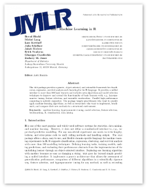

```{r setup, include=FALSE}
knitr::opts_chunk$set(collapse = TRUE)
```

We are happy to announce that we can finally answer the question on how to cite *mlr* properly in publications.

Our paper on *mlr* has been published in the open-access Journal of Machine Learning Research (JMLR) and can be downloaded on the [journal home page](http://www.jmlr.org/papers/v17/15-066.html).

[](http://www.jmlr.org/papers/v17/15-066.html)

The paper gives a brief overview of the features of *mlr* and also includes a comparison with similar toolkits.
For an in-depth understanding we still recommend our excellent [online mlr tutorial](https://mlr.mlr-org.com/) which is now also available as a [PDF](https://arxiv.org/abs/1609.06146) on arxiv.org or as [zipped HTML files](https://mlr.mlr-org.com/devel/mlr_tutorial.zip) for offline reading.

Once *mlr 2.10* hits CRAN you can retrieve the citation information from within R:

```{r, eval=FALSE}
citation("mlr")
```

```{r, echo=FALSE}
tmp = capture.output(citation("mlr"))
tmp = stringi::stri_replace_all_fixed(tmp, "{{", "{{")
cat(paste0(tmp, "\n"))
```

