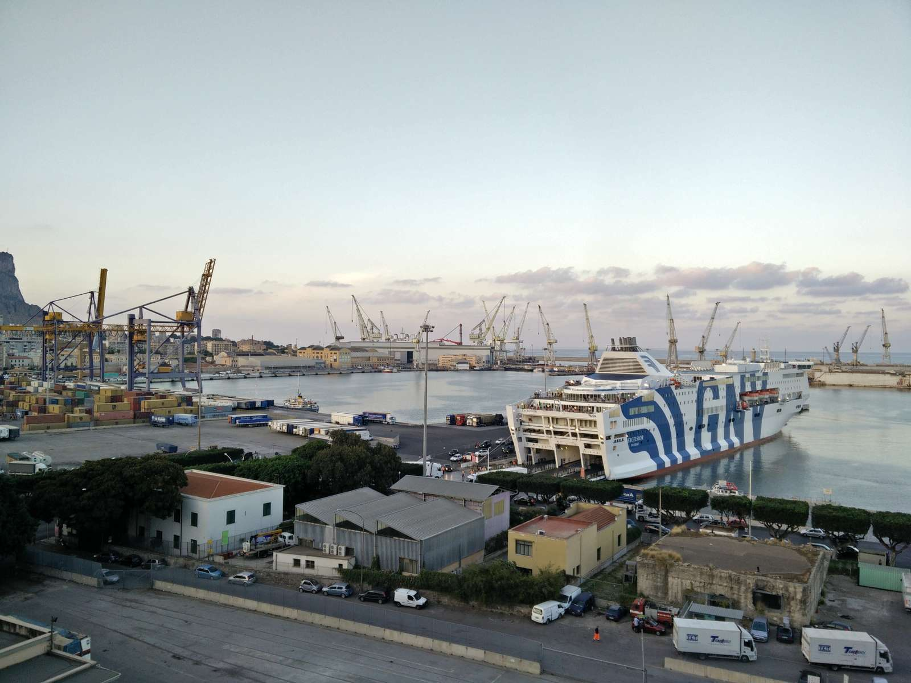
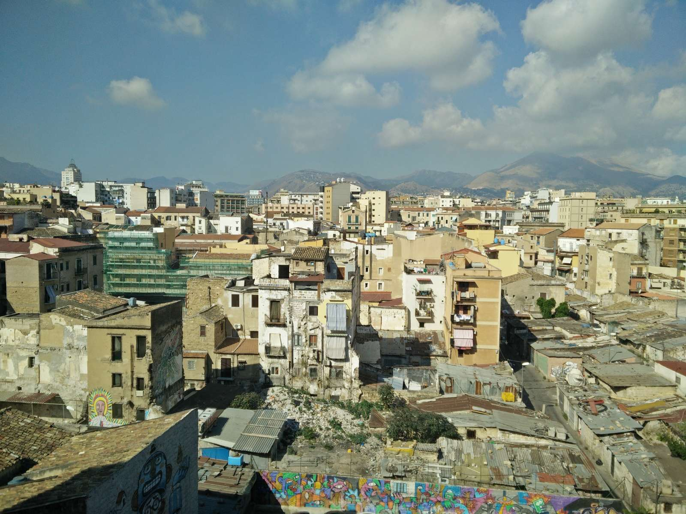
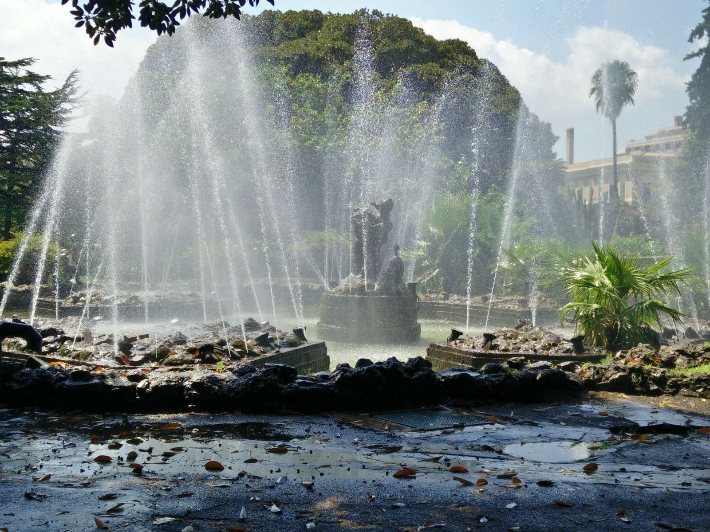

```{r setup, include=FALSE}
knitr::opts_chunk$set(collapse = TRUE)
```

The *mlr developer team* is quite international: Germany, USA, Canada. The time difference between these countries sometimes makes it hard to communicate and develop new features.

The idea for this workshop or [sprint](http://en.wikipedia.org/wiki/Sprint_(software_development)) was to have the possibility to talk about the project status, future and structure, exterminate imperishable bugs and start developing some fancy features.

Since we wanted to meet at a nice place we decided to go to Palermo, where the [department of statistics](https://www.unipa.it/dipartimenti/seas/) provided us with a room in the university for the workshop.

Twelve people from the developer team met from the 8. to 15. August to work on and with mlr.

## Result of the workhop

We closed a lot of issues and developed new features that we will release with version 2.10 of *mlr* in the next few days.

Thanks to all `sample(participants)`: [Giuseppe Casalicchio](http://www.compstat.statistik.uni-muenchen.de/people/casalicchio/), [Janek Thomas](http://www.compstat.statistik.uni-muenchen.de/people/thomas/), [Xudong Sun](http://www.compstat.statistik.uni-muenchen.de/people/Xudong/), [Jakob Bossek](http://www.jakobbossek.de/), [Bernd Bischl](http://www.compstat.statistik.uni-muenchen.de/people/bischl/), [Jakob Richter](http://jakob-r.github.io/), [Michel Lang](https://www.statistik.tu-dortmund.de/lang.html), [Philipp Probst](http://philipppro.github.io/), [Julia Schiffner](https://de.linkedin.com/in/julia-schiffner), [Lars Kotthoff](http://www.cs.ubc.ca/~larsko/), [Zachary Jones](http://zmjones.com/), [Pascal Kerschke](https://www.wi.uni-muenster.de/de/institut/statistik/personen/pascal-kerschke)!

We also head a great time in a great city aside from the workhop, here are some impressions:



