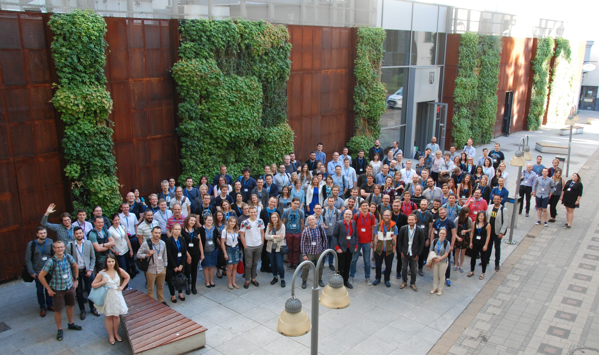

```{r, echo = FALSE, message = FALSE}
knitr::opts_chunk$set(collapse = TRUE, comment = "#>", warning = FALSE)
```

This July we had the great honor to present mlr and its ecosystem at the WhyR 2018 Conference in Wroclaw in Poland.
You can find the slides [here](https://github.com/mlr-org/mlr-outreach).
We want to thank the organizers for inviting us, providing us with great food and coffee and also many thanks all participants for showing great interest in mlr, 

We hope this could spark further improvement and new features as a result of the many interesting discussions we had with the participants.
This really encouraged us to work harder, in order to create an even better software.
We also hope this created interest in participating and contributing to our project, as the community really thrives on knowledge and experience of a very diverse set of people and backgrounds. 




