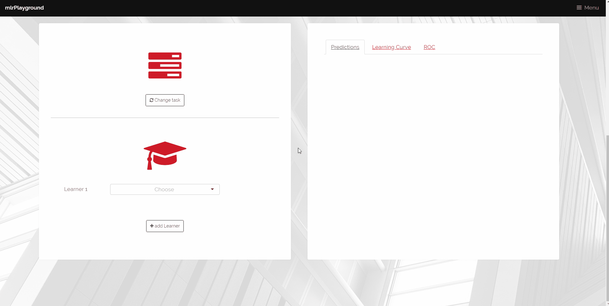
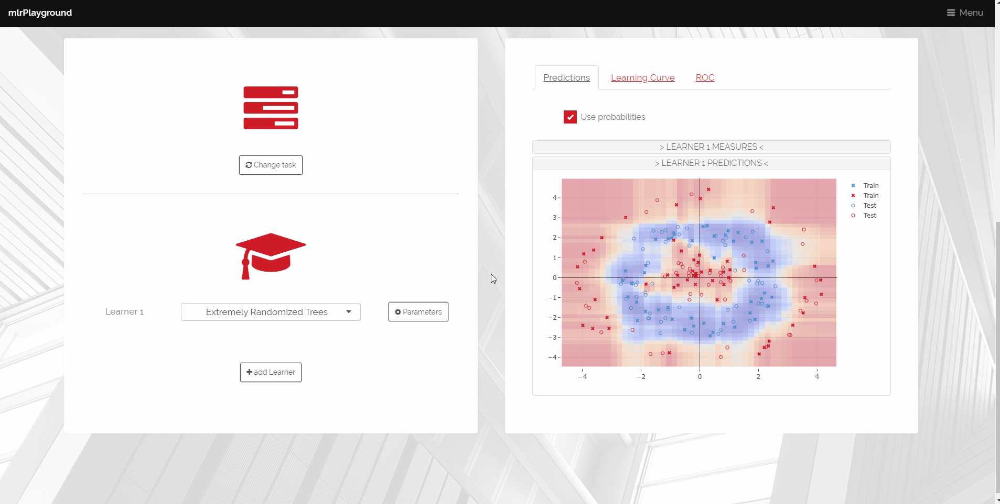
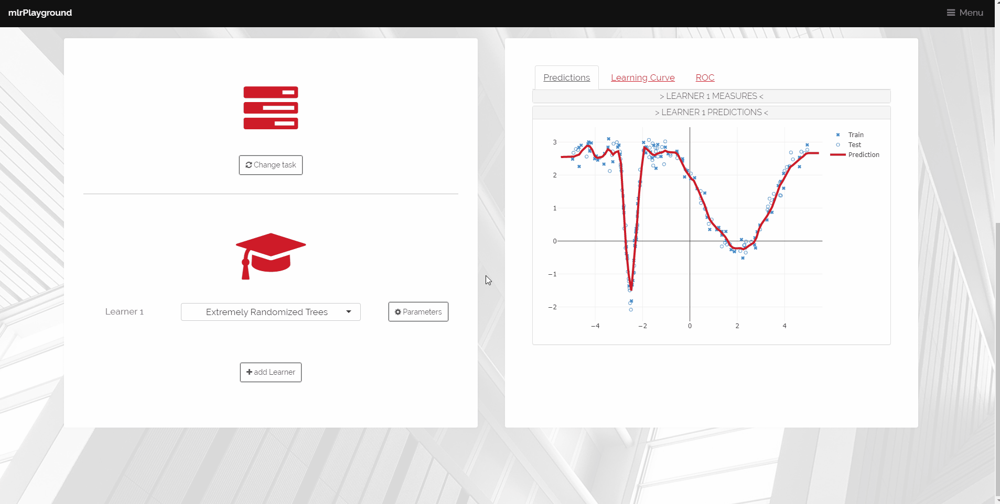
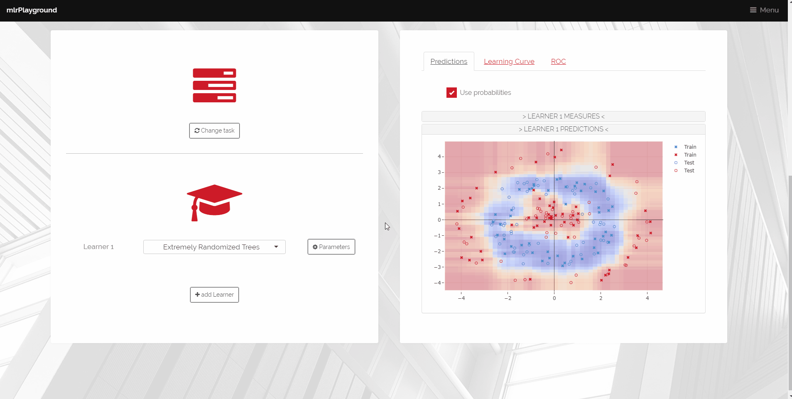
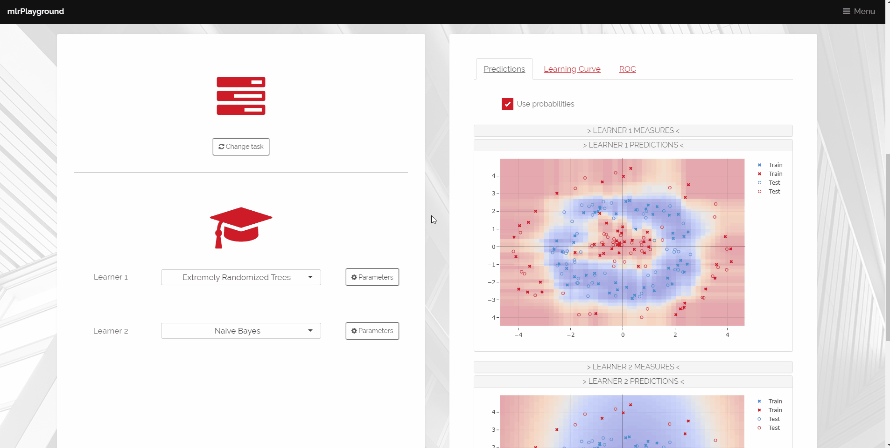

 

## First of all

You may ask yourself how is this name ‘mlrPlayground’ even justified?
What a person dares to put two such opposite terms in a single word and expects people to take him seriously?

I assume most of you know ‘mlr’, for those who don’t: It is a framework offering a huge variety of tools for simplifying machine learning tasks in R.
Quite the opposite from a place, where you can play with your best friends, make new friends, live out your fantasies and just have a great time the whole day until your parents pick you up.
Well, for most of the readers here this may not be the case anymore – we know, we are still young in our heart, but let’s be honest …
For sure, we all have those memories and definitely have certain associations with the word ‘Playground’.
So, what is about this thing called ‘mlrPlayground’?
 

## The idea

The idea behind this project was to offer a platform in the form of a <a href="https://shiny.rstudio.com/">Shiny</a> web application, in which a user can try out different kinds of learners provided by the mlr package.
On a small set of distinct and tunable regression and classification tasks, it is possible to observe the prediction/performance behavior based on changes on the task, the learner or the learner's hyperparameters.
The user is able to gain new insights and a deeper understanding of how a learner performs, where it’s advantages are and in which cases the learner might fail.

There are a lot of different settings we want to offer in the user interface, and so – to not remove the fun of our playground – a huge effort went into creating an aesthetically pleasing and user-friendly UI.
To achieve this, a website template was downloaded from <a href="https://templated.co/">Templated</a> and used as the baseline design.
After extending the template with missing CSS classes, most of the used shiny widgets have been overwritten – or even completely replaced –, offering refreshingly new visuals for the well-known shiny framework.
For the smooth feel of the app, an object-oriented <a href="https://cran.r-project.org/web/packages/R6/index.html">R6</a> class system with reactive attributes was engineered for the backend to give a well-defined framework of which elements should trigger what evaluation; an otherwise extremely tiresome and error-prone task for dozens of different UI elements.

After all ‘mlrPlayground’ may not be as fun as a real playground, but you are also not as likely to hurt yourself and it is definitely more entertaining than looking at boring pictures of learners in a book.
 

## The features

In the following, an extended overview of most available features is presented with the help of animated pictures.

##### Task selection

When running the app and scrolling down you can basically see two big boxes with content: The left one is for the task and learner settings, the right one for an overview of the learner’s behavior.
For first-time users, it is advisable (but not necessary) to explore the different tasks.
After finding the right button (this task is left to the motivated reader) a panel with all available datasets is extended over our screen.
Here, we can choose the task type to receive a varied selection of classification or regression tasks and several other parameters influencing each dataset such as size, noise, and the train/test split.

 

##### Learner selection

Back at the main panel, we can then select a learner for our task – due to limited manpower not all available learners in _mlr_ made it into this selection.
You can expect additions in the future.
By making a selection, the main process of the app, consisting of several substeps, gets executed:

<ul>
<li>
a model is trained on the training set of the defined task
</li>
<li>
performance measures are calculated on the corresponding test set
</li>
<li>
the prediction surface is evaluated and depicted in an interactive plot.
</li>
</ul>

 

##### Performance measures

The first visual change after calculations have finished is the appearance of the prediction plot.
Besides, there are now a whole bunch of different performance measures to explore by clicking on the equally named bar on the right-hand side.
These provide the opportunity to manually tune each learner on the tasks or compare how each measure behaves in certain scenarios.
You will not only be able to understand the learner better, but also each measure.
What's particularly interesting for the latter is the configurable ratio of train and test data in the task selection window.

 

##### Hyperparameters

If you want to see the effect of hyperparameters on the plot/performance measures, simply click on the small cog next to the learner selection.
Now, the left panel is replaced by a window with all available hyperparameters – changes here will have an immediate effect: The whole model will be rerun and all plots/numbers will be updated.

###### Second learner

Only observing changes of a single learner may become a bit boring after time, so an option is available to easily double the fun: Pressing “Add learner” gives the choice of adding a second learner with a second plot, making it possible to compare the prediction surfaces of two different learners on the same task right next of each other.
Exciting!

 

But wait, there’s still more to offer!

 

##### Learning curve and ROC

The user can change the created plots on the right panel by switching to the tabs “Learning Curve” (classification and regression) or “ROC” (only classification).
The former tells you how well the learner performed or how multiple learners compare to each other.
All of this happens with respect to the user selected performance measures (y-axis) on a fraction of the original train data (x-axis).
Every additionally selected measure results in an additional plot.

Last but not least, the ROC curve is only a ROC curve with its default settings for the x- and y-axis: Plotting the true positive rate (TPR) against the false positive rate (FPR).
It shows how well the learner can separate the classes (the bigger the area under the curve, the better).

 

## Usage

If you want to explore _mlrPlayground_ on your own, you have two possibilities:

Either visit the [website](https://compstat-lmu.shinyapps.io/mlrPlayground/) (big thanks to the Department of computational statistics at the LMU Munich for hosting)

or

install it locally on your own machine using `remotes::install_github("SebGruber1996/mlrPlayground")`
and start with `mlrPlayground::start()`.
The first approach is quicker but may crash if too many people access it at the same time, while the latter requires a local installation.
It's your choice.
 

Thanks for spending your time reading this blog post instead of being on a real playground!
 

Side note: The app is still far from being mature.
The UI is -- especially for the hyperparameters -- not working well on small screens.
Also, some hyperparameter settings may cause the app to crash.
Even if these things would be solved, there are still a lot of learners missing in the app which are available in the _mlr_ package.
Pull requests are welcome at https://github.com/SebGruber1996/mlrPlayground.
