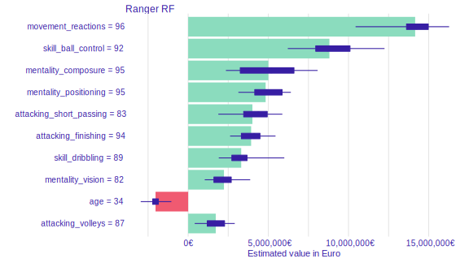

[Przemysław Biecek](https://github.com/pbiecek) and [Szymon Maksymiuk](https://github.com/maksymiuks) added a [new chapter](https://mlr3book.mlr-org.com/interpretability-dalex.html) to the [mlr3 book](https://mlr3book.mlr-org.com/) on how to analyze machine learning models fitted with [mlr3](https://cran.r-project.org/package=mlr3) using the excellent [DALEX package](https://cran.r-project.org/package=DALEX).

The contributed chapter covers an analysis of a random regression forest (implemented in the [ranger package](https://cran.r-project.org/package=ranger)) on data extracted from the FIFA video game.
In more detail, the following methods for explainable machine learning are showcased:

* Dataset level exploration: Feature importance and Partial dependency plots.
* Instance level explanation: Break Down, SHapley Additive exPlanations (SHAP), and Ceteris Paribus plots.

Here is a small preview illustrating the effect of different features on the monetary value of Cristiano Ronaldo:

Read the complete chapter [here](https://mlr3book.mlr-org.com/interpretability-dalex.html).
